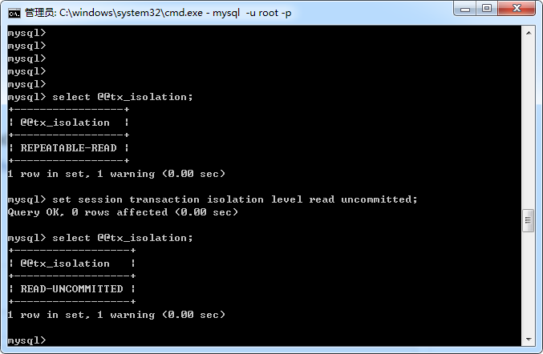

mysql事务的隔离级别

| 隔离级别        | 脏读   |  不可重复读  | 幻读 | 
| --------       | -----:  | :----:  | :----:  |
| 读未提交 read uncommitted       | 是   |   是     | 是 |
| 读已提交 read committed       | 否   |   是   |  是  |
| 可重复读 repeatable read       | 否    |  否  | 是 | 
| 序列化   serializable      |    否  |  否  | 否

读未提交
顾名思意，就是说在A事务还没有提交时，执行了update语句，如果b事务查到了这条记录，会查到update之后的记录，也就是数会查到脏数据。

读已提交
A事务在执行时，如果执行了update语句，会获取一把写锁，B事务如果使用到了update的这些记录，会被阻塞，直到A事务提交，所以读已提交不会导致脏读出现。
但是如果执行的流程是B查询 - A 更新 - A 提交 - B查询，在B事务执行了两次相同的查询，查出来的结果会不一致，出现了不可重复读。

可重复读
A事务执行的update语句会对B事务不可见，但是如果A事务执行了insert语句，B事务执行了查询语句，会查询到A事务新增的语句。幻读

序列化
事务最大的隔离级别，只允许事务读操作，如果某一事务执行了写操作，将导致其他事务失败。

接下来，我们验证一下这几种隔离级别出现的问题，首先，我们来设置一下隔离级别

可能用到的命令：
查询当前会话的事务隔离级别

select @@tx_isolation;

查询当前系统的隔离级别

select @@global.tx_isolation;

设置当前会话的事务隔离级别
set session transaction isolation level read uncommitted;

设置系统的事务隔离级别
set global transaction isolation level read committed;

mysql默认的隔离级别是可重复读

